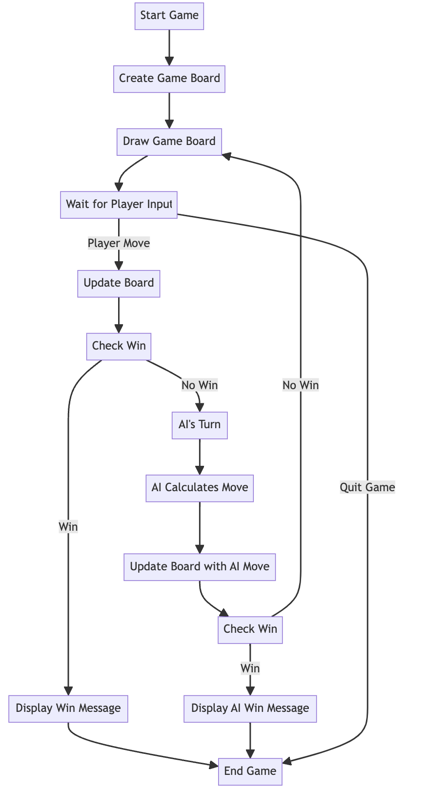

# Connect-4 AI Game

## Description
Connect-4 is a two-player connection game in which the players take turns dropping colored discs from the top into a seven-column, six-row vertically suspended grid. The pieces fall straight down, occupying the next available space within the column. The objective of the game is to be the first to form a horizontal, vertical, or diagonal line of four of one's own discs.

This implementation of Connect-4 uses a Python-based AI, employing the minimax algorithm with alpha-beta pruning to calculate the best moves. The AI's evaluation function is based on the number of two and three-in-a-row sequences, weighted to prioritize winning moves.

## Running the Game

1. First you need to cd into the project from your local:

    ```
    cd Connect-4
    ```
2. To play the game against the AI, run the following command in your terminal:

    ```
    python3 -m gui  # On Unix/macOS
    python -m gui   # On Windows
    ```

3. To run the AI training module:

    ```
    python3 -m gameplay.train_ai  # On Unix/macOS
    python -m gameplay.train_ai   # On Windows
    ```
4. For all the requirements to run, do the following:
   ```
   pip install -r requirements.txt
   ```
## Video 

A video demonstration playing the AI using the GUI user interaction flow:

<a href="https://drive.google.com/file/d/1350FhBpVtW9XTLvYiS4RqC7ZDHwmJB1V/view?usp=drive_link">
    
</a>

## Flowchart of the game logic



## Important Notes

- The AI may take a while to make a move as the search depth is set to 8. You can adjust the depth in the code to suit your testing needs.
- If you wish to retrain the AI from scratch, please delete the existing dataset to ensure a fresh start.

## How to Contribute

This is an assignment project. Contributions to the project are welcome. If you have ideas on how to improve the AI or the game play experience, feel free to fork the repository and submit a pull request.

